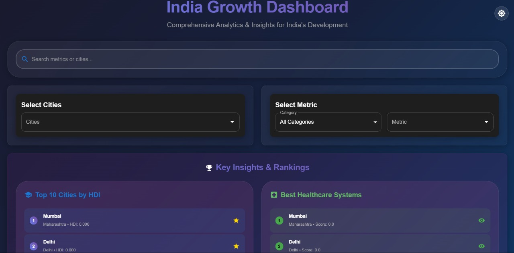
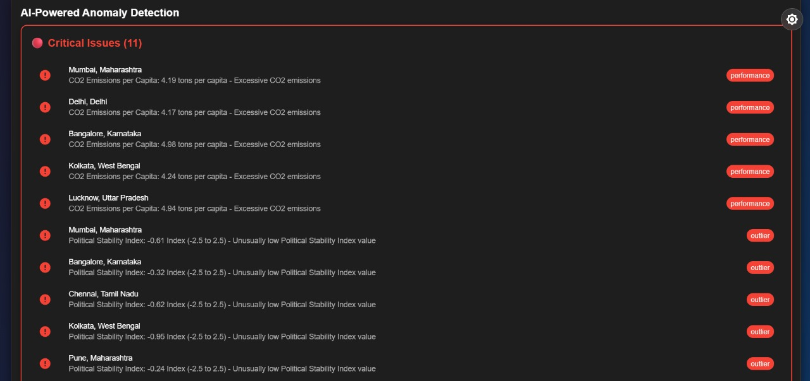
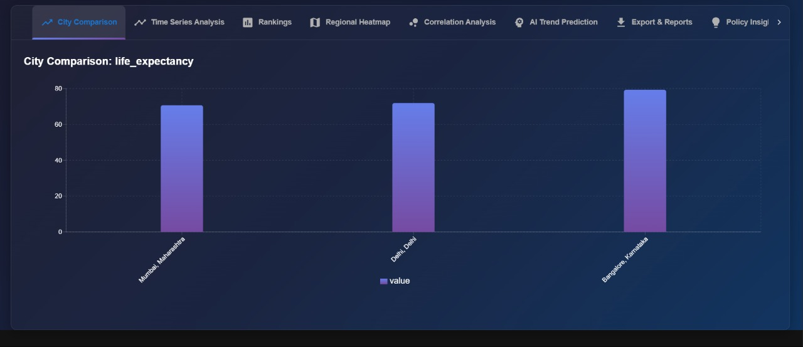

# India Growth Dashboard
*Submitted by: Sumit Kumar Singh*

## 🌟 Live Demo
🔗 **[View Live Demo](https://sumitksinghdev.github.io/india-growth-dashboard/)**

## 📸 Screenshots




## 🛠️ Tech Stack
- Frontend: React, TypeScript
- UI Library: Material-UI (MUI)
- Visualization: Recharts, ECharts
- Deployment: GitHub Pages

## ✨ Unique Features
- **Comprehensive Data Visualization**: 30+ core metrics across 6 categories for major Indian cities.
- **AI-Powered Anomaly Detection**: Identifies critical issues and outliers in city data, such as excessive CO2 emissions or political instability.
- **Advanced Analytics**: Features like time series analysis, regional heatmaps, correlation analysis, and trend prediction provide deep insights into India's development.

## 🚀 Getting Started

### Prerequisites
- Node.js (v18+)
- npm

### Installation
```bash
# Clone and navigate to project
git clone https://github.com/SumitKSinghDev/india-growth-dashboard.git
cd india-growth-dashboard

# Install dependencies
npm install

# Start development server
npm start
```

## 📄 License

This project is licensed under the MIT License.
